# Data-Visualization
## About Dataset
### Dataset Name : Heart-Dataset
Access from <b>Kaggle</b> by using the following link:
<a href = "kaggle datasets download -d pritsheta/heart-attack">Data-set</a>
### Have a look of dataset:
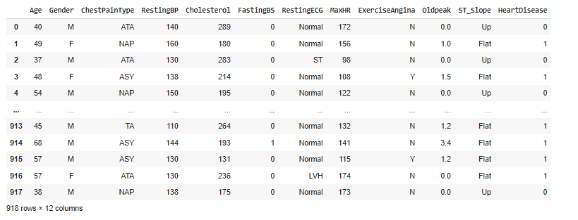 </img>

### Age Vs Cholesterol Using Line Graph:
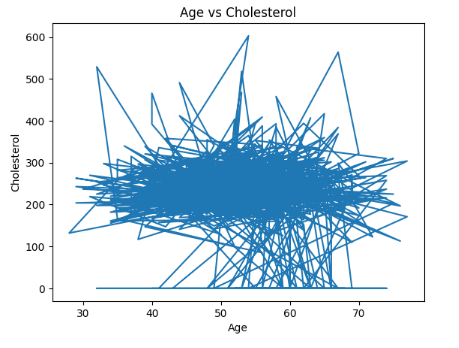 </img>

### Age Vs MaxHR and Age Vs RestingBP:
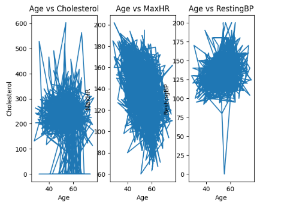 </img>

### Cholesterol Vs RestingBP Using Scatter Plot:
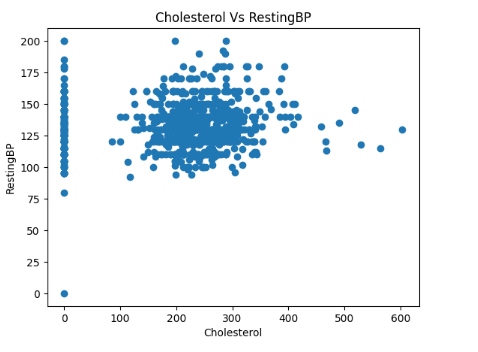 </img>

### Age Vs MaxHR Using Scatter Plot:
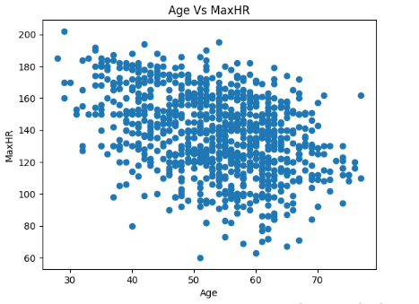 </img>

### Age Vs OldPeak Using Scatter Plot:
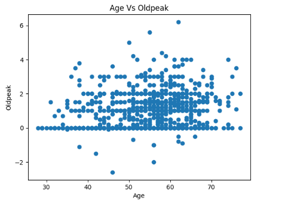 </img>

### Gender Vs Age Using Bar Graph:
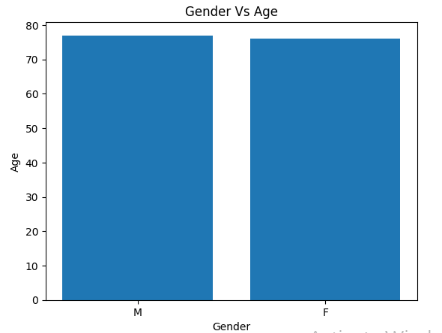 </img>

### Total Male and Female Count:
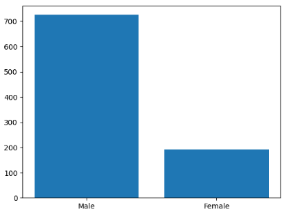 </img>

### ChestPainType Counts:
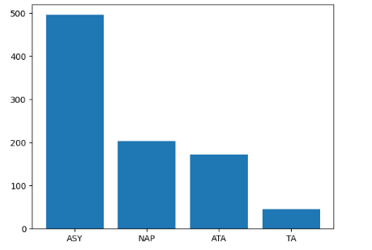 </img>

### ChestPainType Vs Age:
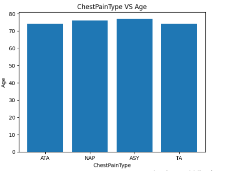 </img>

### Heart Disease Count:
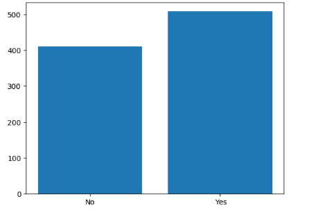 </img>

