# Heart Disease Data Visualization

This repository contains a data visualization performed on a Heart Disease dataset using Python.

## Dataset
The dataset used in this project contains medical attributes related to heart disease.

File:
- D3_Heart_Dataset.csv

## Project Workflow
The notebook performs the following steps:

- Loading the dataset using Pandas
- Data exploration and inspection
- Data preprocessing
- Visualizing patterns and relationships in the dataset
- Creating different charts and graphs for analysis

## Tools and Libraries Used
- Python
- Pandas
- NumPy
- Matplotlib
Matplotlib is a Python plotting library widely used to create graphs and charts for data visualization.

## About Dataset
### Dataset Name : Heart-Dataset
Access from <b>Kaggle</b> by using the following link:
<a href = "kaggle datasets download -d pritsheta/heart-attack">Data-set</a>
### Have a look of dataset:
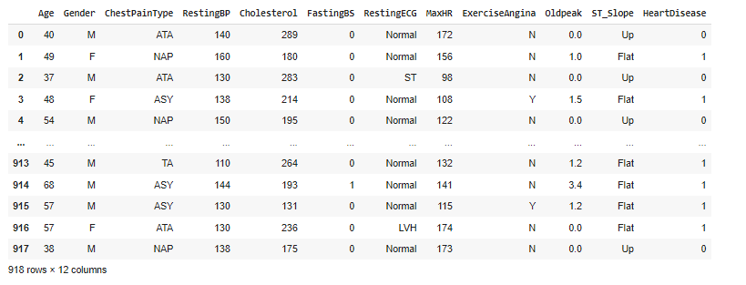 </img>

### Age Vs Cholesterol Using Line Graph:
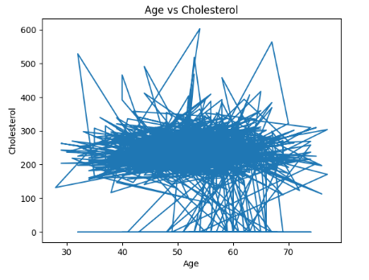 </img>

### Age Vs MaxHR and Age Vs RestingBP:
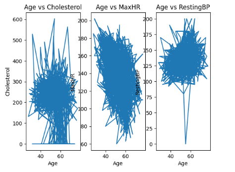 </img>

### Cholesterol Vs RestingBP Using Scatter Plot:
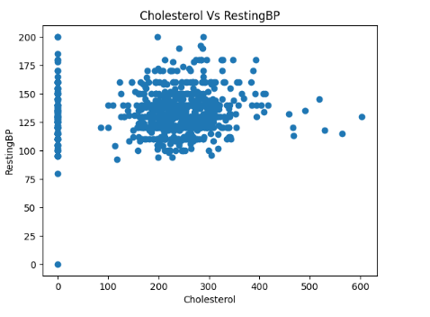 </img>

### Age Vs MaxHR Using Scatter Plot:
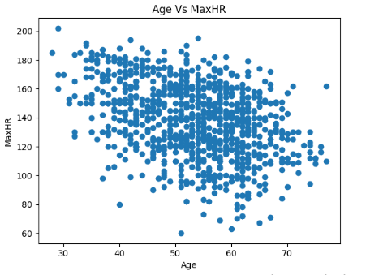 </img>

### Age Vs OldPeak Using Scatter Plot:
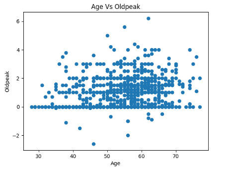 </img>

### Gender Vs Age Using Bar Graph:
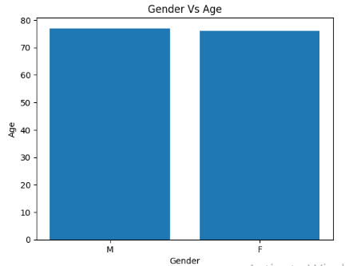 </img>

### Total Male and Female Count:
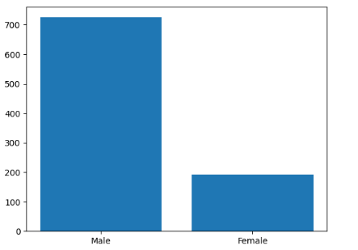 </img>

### ChestPainType Counts:
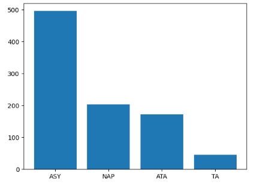 </img>

### ChestPainType Vs Age:
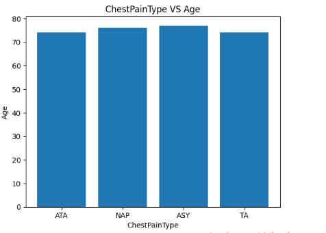 </img>

### Heart Disease Count:
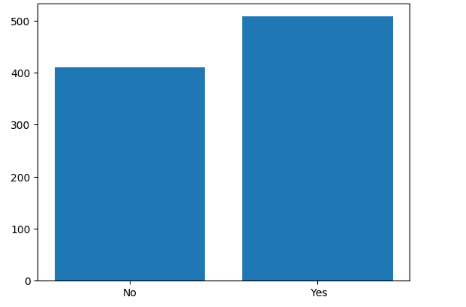 </img>

